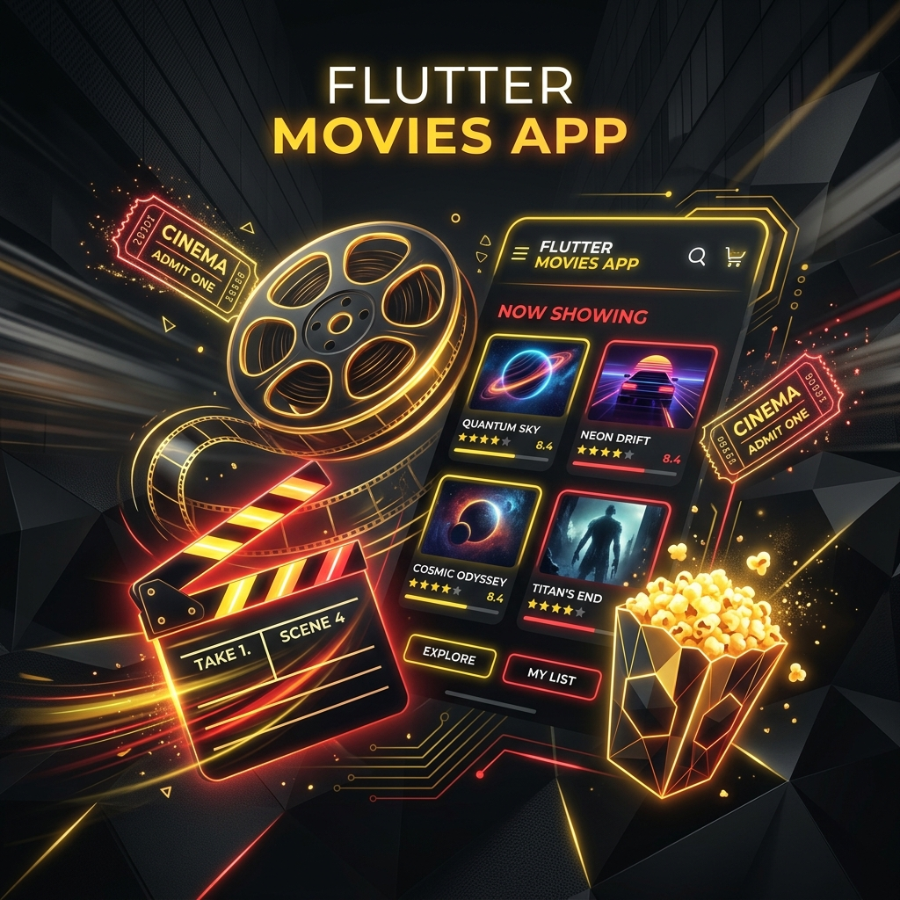

<div align="center">
  

  # 🎬 Movies App

  [](https://flutter.dev)
  [](https://dart.dev)
  [](https://en.wikipedia.org/wiki/Model%E2%80%93view%E2%80%93viewmodel)
  [](https://bloclibrary.dev)

  ### *Your Ultimate Cinematic Companion*
</div>

---

## 🌟 Overview

**Movies App** is a premium, feature-rich Flutter application designed for movie enthusiasts. Built with a focus on **clean architecture (MVVM)** and robust state management using **BLoC**, it provides a seamless and high-performance experience for discovering, tracking, and managing your favorite cinematic content.

From browsing the latest blockbusters to maintaining a personal watch list, Movies App delivers a world-class UI/UX with smooth animations and multi-language support.

---

## ✨ Features

- 🔐 **Secure Authentication**: Full sign-up and login flow to protect your personalized experience.
- 🔁 **Account Management**: Forgot password recovery and profile update capabilities.
- 🔍 **Global Movie Search**: Instantly find any movie through a powerful REST API integration.
- ❤️ **Personal Collection**: Add movies to your favorites with a single tap.
- 📦 **Offline Watched List**: Keep track of movies you've already seen, persisted locally via **Hive**.
- 🌍 **Internationalization**: Fully localized support for multiple languages (English/Arabic).
- 🎨 **Premium UI**: Modern dark theme with cinematic aesthetics and high-end visual feedback.

---

## 🛠️ Tech Stack & Architecture

This project is built using modern industry standards to ensure scalability and maintainability.

| Layer | Technology |
| :--- | :--- |
| **Framework** | [Flutter](https://flutter.dev) 🚀 |
| **State Management** | [BLoC](https://pub.dev/packages/flutter_bloc) 🧱 |
| **Architecture** | Clean Architecture (MVVM) 🏗️ |
| **Networking** | [HTTP](https://pub.dev/packages/http) 🌐 |
| **Local Storage** | [Hive](https://pub.dev/packages/hive) 💾 |
| **Fonts** | [Google Fonts](https://pub.dev/packages/google_fonts) 🖋️ |
| **Caching** | [Cached Network Image](https://pub.dev/packages/cached_network_image) 🖼️ |

---

## 🚀 Getting Started

### Prerequisites

* Ensure you have the [Flutter SDK](https://docs.flutter.dev/get-started/install) installed.
* A physical device or emulator (Android/iOS).

### Installation

1. **Clone the repository:**
   ```bash
   git clone https://github.com/Mustafa-Mohamed26/flutter-movies-app.git
   cd flutter-movies-app
   ```

2. **Install dependencies:**
   ```bash
   flutter pub get
   ```

3. **Generate localizations and Hive adapters:**
   ```bash
   flutter pub run build_runner build
   ```

4. **Launch the application:**
   ```bash
   flutter run
   ```

---

## 📂 Project Roadmap

- [x] Initial Authentication Flow
- [x] Movie Discovery & Search integration
- [x] Local Storage for Favorites & Watched List
- [x] Multi-language support (English/Arabic)
- [ ] Watchlist Notifications (Planned)
- [ ] Dark/Light Theme Toggle (Planned)

---

## 🤝 Contributing

We welcome contributions! If you'd like to improve Movies App:
1. Fork the Project.
2. Create your Feature Branch (`git checkout -b feature/AmazingFeature`).
3. Commit your Changes (`git commit -m 'Add some AmazingFeature'`).
4. Push to the Branch (`git push origin feature/AmazingFeature`).
5. Open a Pull Request.

---

## 📄 License

Distributed under the **MIT License**. See `LICENSE` for more information.

---

<div align="center">
  Developed by <a href="https://github.com/Mustafa-Mohamed26">Mustafa Mohamed</a>
</div>
